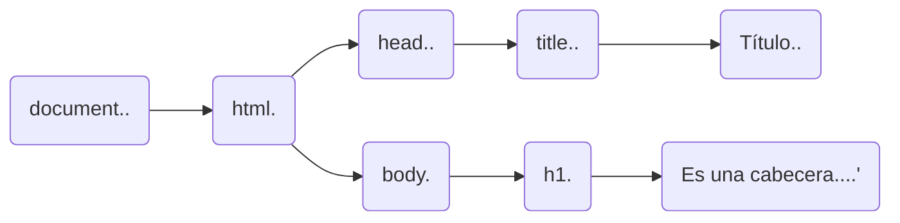

# Introducción a Vue.js 3

<div class="pt-12">
  <span @click="$slidev.nav.next" class="px-2 py-1 rounded cursor-pointer" hover="bg-white bg-opacity-10">
    Empecemos <carbon:arrow-right class="inline"/>
  </span>
</div>

<div class="abs-br m-6 flex gap-2">
  <button @click="$slidev.nav.openInEditor()" title="Open in Editor" class="text-xl icon-btn opacity-50 !border-none !hover:text-white">
    <carbon:edit />
  </button>
  <a href="https://github.com/FranzAnt/Vue-3-Intro-Slide" target="_blank" alt="GitHub"
    class="text-xl icon-btn opacity-50 !border-none !hover:text-white">
    <carbon-logo-github />
  </a>
</div>


---
layout: section
---

# Conceptos


---

# ¿Qué es la DOM ?

Dom significa Document Object Model, y es la interfaz de nuestro navegador (API) para cambiar lo que se muestra en el navegador.

<div class="grid grid-cols-3 gap-10 pt-4 -mb-1">

```html {all|1|1-6|9|all}

<!DOCTYPE html>
<html lang="es">
  <head>
      <title>Título</title>
  </head>
  <body>
    <h1>Es una cabecera</h1>
  </body>
</html>

```




</div>


<arrow v-click="2" x1="400" y1="420" x2="230" y2="330" color="#564" width="3" arrowSize="1" />

<style>
.footnotes-sep {
  @apply mt-20 opacity-10;
}
.footnotes {
  @apply text-sm opacity-75;
}
.footnote-backref {
  display: none;
}
</style>


---

# ¿Cómo se manipula el DOM?

Usamos JavaScript para manipular DOM, así: 


```js
let item = document.getElementsByTagName("h1")[0];
item.textContent = "Nueva Cabecera";

```


---

# Problema con el DOM

El problema subyacente con el uso y la manipulación del DOM es que algunas páginas tienen miles de nodos.


Es por eso que algunos marcos (como Vue) tienen algo llamado DOM virtual. El DOM virtual es una forma de representar el DOM real con objetos JavaScript.


---

# La solución


Arriba puede ver cómo podemos expresar un div como un objeto JavaScript. A continuación, sabrá cómo tomar este nodo virtual y realizar las llamadas de JavaScript adecuadas para crear un nodo DOM real en el navegador. En realidad, hay un paso adicional en este ciclo de vida, llamado funciones de renderizado.

---

# ¿Qué es Vue?

Vue (pronunciado / vjuː /, como vista) es un marco progresivo para construir interfaces de usuario.


- A diferencia de otros marcos monolíticos, Vue está diseñado desde cero para ser adoptable de forma incremental. 
- La biblioteca principal se centra solo en la capa de vista y es fácil de recoger e integrar con otras bibliotecas o proyectos existentes.
- Vue también es perfectamente capaz de impulsar aplicaciones sofisticadas de una sola página cuando se usa en combinación con [herramientas modernas](https://v3.vuejs.org/guide/single-file-component.html) y [bibliotecas de soporte](https://github.com/vuejs/awesome-vue#components--libraries) .
<br>
<br>

Puedes leer más de [¿Por qué Vue?](https://v3.vuejs.org/guide/introduction.html)


<style>
h1 {
  background-color: #2B90B6;
  background-image: linear-gradient(45deg, #4EC5D4 10%, #146b8c 20%);
  background-size: 100%;
  -webkit-background-clip: text;
  -moz-background-clip: text;
  -webkit-text-fill-color: transparent; 
  -moz-text-fill-color: transparent;
}
</style>

<!--
The last comment block of each slide will be treated as slide notes. It will be visible and editable in Presenter Mode along with the slide. [Read more in the docs](https://sli.dev/guide/syntax.html#notes)
-->

---

# ¿Qué es una función de renderizado?

La función de render es lo que crea el nodo virtual, que se envía a Vue para actualizar el DOM.


<div class="grid mx-2">


  </div>


---

# ¿Qué es una función de renderizado?

La función de render es lo que crea el nodo virtual, que se envía a Vue para actualizar el DOM. Más tarde, si los datos utilizados por la función de renderizado cambian, la función de renderizado se ejecutará nuevamente produciendo un nuevo nodo DOM virtual. Luego, Vue toma el nodo antiguo y el nuevo, compara los dos y realiza las llamadas DOM apropiadas para cambiar la página web.

<div class="grid mx-28">
  
</div>

<!--
La función de render es lo que crea el nodo virtual, que se envía a Vue para actualizar el DOM. Más tarde, si los datos utilizados por la función de renderizado cambian, la función de renderizado se ejecutará nuevamente produciendo un nuevo nodo DOM virtual. Luego, Vue toma el nodo antiguo y el nuevo, compara los dos y realiza las llamadas DOM apropiadas para cambiar la página web.
-->

---

# Una analogía del DOM virtual


<div grid="~ cols-2 gap-4">
  <div>

   <div class="grid mx-24">
        
    </div>
  </div>
<div>
  Deseo realizar  cambios en piso 29 de un edificio de 100 pisos


  - Puedo demoler todo en el piso 29 y empezar de cero.
  - Puedo crear nuevos planos, comparar las diferencias y realizar actualizaciones con la mínima cantidad de trabajo.
</div>
</div>


---

# Anatomía de Vue 3


<div grid="~ cols-3 gap-4">
<div>

### Módulo de reactividad
Los objetos reactivos se inicializan 

</div>
<div>

### Módulo compilador

  Se convierte el HTML en una función de renderizado.

 
</div>
  
  
<div>
  
### Módulo Renderer. 
  Se compone de 3 fases:
- Fase de renderizado
- Fase de montaje (o creación)
- Fase de parche (o actualización)

</div>
</div>

<!--
Preguntar que es la reactividad.
Módulo de reactividad. Esto permite crear objetos reactivos de JavaScript que pueden observarse en busca de cambios. Cuando se ejecuta el código que utiliza estos objetos, se realiza un seguimiento para ejecutarlo más tarde si cambia el objeto reactivo. 
Módulo compilador. Esto sabe cómo tomar plantillas HTML y compilarlas en funciones de renderizado. Esto puede suceder en el navegador en tiempo de ejecución, pero ocurre más a menudo cuando se crea un proyecto de Vue, por lo que un navegador solo recibe funciones de renderizado. 
Módulo Renderer. El renderizador contiene el código para 3 fases diferentes de renderizado de un componente en una página web. 
Fase de renderizado. Cuando se llama a la función de renderización y devuelve una representación del DOM real llamado DOM virtual. El DOM virtual es una representación de objeto JavaScript de lo que se procesará en el navegador. 
Fase de montaje (o creación): el renderizador toma el objeto DOM virtual y realiza llamadas JavaScript DOM reales para crear una página web. 
Fase de parche (o actualización): el renderizador toma los dos objetos DOM virtual, uno antiguo y uno nuevo, y actualiza solo las partes de la página web que han cambiado usando llamadas DOM JavaScript.
-->


---
layout: section
---

# Configuración


---

# Herramientas

IDE:    
- Visual Code
	
    Descarga: https://code.visualstudio.com/download 


Complementos
- Vetur
- Es6-string-html
- Live Server
- Prettier - Code formatter


---

# Repositorio

- Descarga git
https://git-scm.com/downloads 
- Clona el proyecto: 
	git clone https://github.com/FranzAnt/Vue-3-Intro
- git checkout CX_base
- git checkout CX_end


---
layout: section
---

# Indice


---

# Estructura

<div class="grid mx-2">


  </div>


---

# ¿Qué veremos?


- Creación de la aplicación Vue

- ENLAZADO de atributos 

- RENDERIZADO condicional

- RENDERIZADO DE LISTAS

- Manejo de eventos

- ENLAZADO DE clases y estilos

- Propiedades COMPUTADAS

- OBSERVADORES

- Formularios y V-model

- Componentes


---
layout: section
---

# Creación de la aplicación Vue


---


# Creando la aplicación Vue

Para mostrar nuestros datos dentro de nuestro HTML, primero tendremos que crear una aplicación Vue. En nuestro archivo main.js , crearemos nuestra aplicación con:


📄 main.js
```js
  const app = Vue.createApp({})
```

Como argumento, vamos a pasar un objeto y agregar una propiedad de **data**. Esta será una función que devuelve otro objeto, donde almacenaremos nuestros datos. Aquí, lo agregaremos product como un elemento de **data**.


📄 main.js
```js
const options = {
	data: () =>({
      title: 'Todo List'
    })
}
const app = Vue.createApp(options)
```
---

# Creando la aplicación Vue

Ahora solo debemos asegurarnos de que estamos importando nuestra aplicación Vue en el archivo index.html.

📄 index.html
```html
<!-- Import App -->
<script src="./main.js"></script>
```


---

# Montaje de nuestra aplicación

Ahora que hemos creado nuestra aplicación, necesitamos montar la aplicación que acabamos de crear en nuestro DOM. Lo haremos dentro de una etiqueta de script, en nuestro archivo index.html .

📄 index.html
```html
<script>
  const appMount = app.mount('#app')
</script>
```
---

# Visualización de los datos


Ahora que hemos creado, importado y montado la aplicación Vue, ahora podemos comenzar a mostrar los datos que residen en ella.

Para representar los productdatos dentro de h1, escribiremos:

📄 index.html
```html
<div id="app">
  <h1>{{ title }}</h1>
</div>
```

Ahora, si revisamos el navegador, veremos que se muestra "Todo List". ¡Excelente! Pero, ¿cómo funciona exactamente esto?


---

# La instancia de Vue
Cuando creamos nuestra aplicación Vue, pasamos el objeto de opciones, lo que nos permitió agregar algunas propiedades opcionales para configurar la aplicación. Al hacer esto, se crea nuestra instancia de Vue, el corazón de nuestra aplicación Vue, que impulsa todo.

📄 main.js

```js
const app = Vue.createApp({Options Object})
```
Al importar esta aplicación y montarla en el DOM, básicamente hemos conectado la aplicación a nuestro DOM, lo que le da a nuestro HTML una línea directa en la aplicación. De esta manera, nuestro código de plantilla puede acceder a opciones de la aplicación, como sus datos.

Si esta sintaxis de doble llave, o sintaxis de bigote, es nueva para usted, nos permite escribir expresiones JavaScript. En otras palabras, nos permite ejecutar JavaScript válido dentro de nuestro HTML.

---

# Reactividad de Vue

¿Qué pasaría si cambiamos el valor de title  de  "Todo List" a "Mis actividades"?


📄 main.js
```js
const options = {
	data: () =>({
      title: 'Mis Actividades' // updated data value //
    })
}
const app = Vue.createApp(options)
```


---

# Reactividad de Vue
Debido a cómo funciona Vue, la h1 expresión 'en la que se basa title recibiría automáticamente ese nuevo valor, y nuestro DOM se actualizaría para mostrar "Mis actividades".

📄 index.html
```html
<div id="app">
  <h1>{{ title }}</h1> <! -- will reactively receive any updates to title -->
</div>
```

Esto se debe a que Vue es reactivo . Debajo del capó, Vue tiene un sistema de reactividad completo que maneja las actualizaciones. Cuando un valor de datos cambia, cualquier lugar que dependa de esos datos se actualizará automáticamente para nosotros. No tenemos que hacer nada para que eso suceda.


---

# Código de Salida

📄 index.html
```html
<!DOCTYPE html>
<html lang="es">
  <head>
    <meta charset="UTF-8" />
    <title>Taller de Vue 3</title>
    <!-- Import Styles -->
    <link rel="stylesheet" href="./assets/styles.css" />
    <!-- Import Vue.js -->
    <script src="https://unpkg.com/vue@3.0.0/dist/vue.global.js"></script>
  </head>
  <body>
    <div id="app">
        <h1>{{ title }}</h1> 
    </div>

    <!-- Import Js -->
    <script src="./main.js"></script>
    <script>
        const appMount = app.mount('#app')
      </script>
  </body>
</html>
```
---

# Código de Salida
📄 main.js
```js
const options = {
	data: () =>({
      title: 'Mis Actividades' // updated data value //
    })
}
const app = Vue.createApp(options)
```

---
layout: section
---

# Enlace de atributos


---

# Directiva v-bind
El mostacho *( { { } } )* no se pueden usar dentro de los atributos HTML. En su lugar, use la directiva v-bind:

```html
<div v-bind:id="objectID"> ... </div>
<!-- SHORTHAND --> 
<div :id="objectID"> ... </div>
```

Si el valor enlazado es nulo o indefinido, el atributo no se incluirá en el elemento renderizado.

En el caso de los atributos booleanos, donde su mera existencia implica verdadero, v-bind funciona de manera un poco diferente. Por ejemplo:
```html
<button v-bind:disabled="isButtonDisabled"> ... </div>
```


El atributo disabled se incluirá si isButtonDisabled tiene un valor de verdad. También se incluirá si el valor es una cadena vacía, manteniendo la coherencia con 
< button disabled = "" > . Para otros valores falsos, el atributo se omitirá.


---


---
layout: section
---

# Renderizado Condicional


---

# Renderizado Condicional

 La directiva v-if se usa para renderizar condicionalmente un bloque. El bloque solo se renderizará si la expresión de la directiva devuelve un valor verdaderoo.
```html
<div v-if="date == today"> ... </div>
```
También es posible agregar un "bloque else" con v-else:
```html
<div v-else> ... </div> 
```
Puede usar la directiva v-else-if para indicar un "bloque else" para v-if:
```html
<div v-else-if="! done"> ... </div>
```
Otra opción para mostrar un elemento de forma condicional es la directiva v-show. Alterna la visualización de CSS en el lugar de editar DOM. El uso es básicamente el mismo:

```html
<div v-show="date == today">...</div> 
```


---
layout: section
---

# Renderizado de Listas


---

# Renderizado de Listas
Podemos usar la directiva v-for para renderizar una lista de elementos basada en una matriz. La directiva v-for requiere una sintaxis especial en forma **item in items**, donde **items** es la matriz de datos de origen y **item** es un alias para el elemento de matriz en el que se itera.

Iteración básica sobre la lista

```html
<li v-for="item in items" :key="item"> <!-- alternativo: item of items-->
      {{ item }} 
</li>
```
Iteración e índice de seguimiento 
```html
<li v-for="(item,index) in items"> 
  {{ index }} : {{ item }} 
</li>
```

Iteración sobre los valores del objeto
```html
<li v-for="(value, key) in object">
  {{ key }} : {{ value }}
</li>
```


---
layout: section
---

# Manejo de Eventos


---

# Manejo de Eventos
Podemos usar la directiva v-on, que normalmente acortamos al símbolo @, para escuchar eventos DOM y ejecutar algo de JavaScript cuando se activan.
```html
<div v-on:click="count=count+1">Increase</div> 
```
Sin embargo, la lógica para muchos controladores de eventos será más compleja, por lo que mantener su JavaScript en el valor del atributo v-on no es factible. Es por eso que v-on también puede aceptar el nombre de un método al que le gustaría llamar.

Captura un evento y llama a un método
```html
<div v-on:click="incrementCount">Increase</div> 
<!-- SHORTHAND --> 
<div @click="incrementCount">Increase</div>
<!-- SHORTHAND --> 
<div @click="incrementCount()">Increase</div>
```


---
layout: section
---

# Enlace bidireccional


---

# Enlace bireccional

Enlace bidireccional 
```html
<input v-model="email" /> 
```

Modificadores de entrada
```html
.lazy en evento de cambio
.trim elimina los espacios en blanco adicionales
```


---
layout: section
---

# Enlace de clases y estilos


---

# Enlace de clases y estilos

Una necesidad común para el enlace de datos es manipular la lista de clases de un elemento y sus estilos en línea. Dado que ambos son atributos, podemos usar v-bind para manejarlos: solo necesitamos calcular la cadena final con nuestras expresiones. 
Sin embargo, entrometerse con la concatenación de cadenas es molesto y propenso a errores. Por esta razón, Vue proporciona mejoras especiales cuando se usa v-bind con clase y estilo. Además de las cadenas, las expresiones también pueden evaluar objetos o matrices.

```html
<input :class = "{error: hasError}" />
<input :style = "{margin: space + "px"}" />
```


---

## Estilos


---

## Estilos


---

## Clases


---

## Clases


---
layout: section
---

# Propiedades computadas


---

# Expresiones Javascript

Las expresiones dentro de la plantilla son muy convenientes, pero están diseñadas para operaciones simples. Poner demasiada lógica en sus plantillas puede hacer que sean infladas y difíciles de mantener. Por ejemplo, si tenemos un objeto con una matriz anidada:

```js
Vue.createApp({
  data:()=>({
      author: {
        books: [
          'Vue 2 - Advanced Guide',
          'Vue 3 - Basic Guide',
          'Vue 4 - The Mystery'
        ]
      }
    })
})
```


---

# Expresiones Javascript

Y queremos mostrar diferentes mensajes dependiendo de si author ya tiene algunos libros o no.
```html
<div id="computed-basics">
  <p>Has published books:</p>
  <span>{{ author.books.length > 0 ? 'Yes' : 'No' }}</span>
</div>
```

En este punto, la plantilla ya no es simple y declarativa. Tienes que mirarlo un segundo antes de darte cuenta de que realiza un cálculo en función de *author.books*. El problema se agrava cuando desea incluir este cálculo en su plantilla más de una vez.

Es por eso que para la lógica compleja que incluye datos reactivos, debe usar una propiedad computada .


---

Es muy sencillo crear una propiedad computada ya que apenas se diferencia de la creación de métodos, y sería de esta forma:

```js
Vue.createApp({
  data() {
    return {
      author: {
        name: 'John Doe',
        books: [
          'Vue 2 - Advanced Guide',
          'Vue 3 - Basic Guide',
          'Vue 4 - The Mystery'
        ]
      }
    }
  },
  computed: {
    // a computed getter
    publishedBooksMessage() {
      // `this` points to the vm instance
      return this.author.books.length > 0 ? 'Yes' : 'No'
    }
  }
}).mount('#computed-basics')
```


---

# Ejemplo
Aquí hemos declarado una propiedad calculada publishedBooksMessage.

Intente cambiar el valor de la booksmatriz en la aplicación datay verá cómo publishedBooksMessagecambia en consecuencia.

Puede vincular datos a propiedades calculadas en plantillas como una propiedad normal. Vue es consciente de que vm.publishedBooksMessage depende de vm.author.books, por lo que actualizará cualquier enlace que dependa de vm.publishedBooksMessage cuándo vm.author.bookscambia. Y la mejor parte es que hemos creado esta relación de dependencia de forma declarativa: la función getter calculada no tiene efectos secundarios, lo que hace que sea más fácil de probar y comprender.

---
layout: section
---

# Observadores

---

# Observadores
Si bien las propiedades computadas son más apropiadas en la mayoría de los casos, hay ocasiones en las que es necesario un observador personalizado. Es por eso que Vue proporciona una forma más genérica de reaccionar a los cambios de datos a través de la opcion watch . Esto es más útil cuando desea realizar operaciones asincrónicas o costosas en respuesta a datos cambiantes.

```js
Vue.createApp({
  data:()=>({
      author: {
        books: [
          'Vue 2 - Advanced Guide',
          'Vue 3 - Basic Guide',
          'Vue 4 - The Mystery'
        ]
      }
    })
})
```


---

# Observadores
Luego, tenemos que mirar la estructura de un método de observador. Todo lo que tiene que hacer es declarar una función con el mismo nombre que la propiedad que desea observar.

Debería tomar dos parámetros:

- El nuevo valor de la propiedad vigilada
- El antiguo valor de la propiedad vigilada

Por ejemplo, este es un observador de la propiedad del título.


---
layout: section
---

# Componentes y propiedades
---

# Props
* VueJS utiliza un flujo de datos unidireccional, de padre a hijo
* El padre pasa "datos" al hijo
* El hijo lo recibe como un `prop`
* Padre cambia `datos`,` prop` cambia en el hijo
* El componente no puede alterar directamente sus propios *props*
* Un componente hijo necesita declarar explícitamente los accesorios que espera recibir usando la opción de props.


---

# Definir props dentro del componente.

Los props son la forma en que los componentes pueden aceptar datos de los componentes que los incluyen (componentes principales).

Cuando un componente espera uno o más props, debe definirlos en su propiedad props:

```js
Vue.component('user-name', {
  props: ['name'],
  template: '<p>Hi {{ name }}</p>'
})
```
---

# Establecer el tipo de prop
Puede especificar el tipo de prop usando un objeto en lugar de una matriz, usando el nombre de la propiedad como clave de cada propiedad y el tipo como valor:

```js
Vue.component('user-name', {
  props: {
    firstName: String,
    lastName: String
  },
  template: '<p>Hi {{ firstName }} {{ lastName }}</p>'
})
```
---

# Establecer el tipo de prop
Los tipos válidos que puede utilizar son:
- String
- Number
- Boolean
- Array
- Object
- Date
- Function
- Symbol


---

# Establecer el tipo de prop
Los tipos válidos que puede utilizar son:
- String
- Number
- Boolean
- Array
- Object
- Date
- Function
- Symbol


---

# Pasando props al componente
Pasas un accesorio a un componente usando la sintaxis si lo que pasa es un valor estático.

```js
<ComponentName color = "white" />
```

Si es una propiedad de datos, usa

```js

Vue.component('user-name', {
    data: function() {
    return {
      color: 'white'
    }
  },
  template: '<ComponentName :color=color />'
})

```

---

# Slot en componentes

Vue implementa una API de distribución de contenido que se modela después del borrador de especificaciones de componentes web actual, usando el elemento < slot > para servir como puntos de distribución para el contenido.

Esto le permite componer componentes como este:

```js

<navigation-link url="/profile">
  Su Perfil
</navigation-link>

```

Luego en la plantilla para < navigation-link >, es posible que usted tenga:

```js
<a
  v-bind:href="url"
  class="nav-link"
>
  <slot></slot>
</a>

```
---

# Slot en componentes

Cuando el componente renderiza, el elemento < slot > será reemplazado por “Su Perfil”. Los Slots pueden contener cualquier plantilla de código, incluyendo HTML:

```js
<navigation-link url="/profile">
  <!-- Añadir un ícono de Font Awesome -->
  <span class="fa fa-user"></span>
  Su Perfil
</navigation-link>

```

O incluso otros componentes:

```js
<navigation-link url="/profile">
  <!-- Use un componente para agregar un ícono -->
  <font-awesome-icon name="user"></font-awesome-icon>
  Su Perfil
</navigation-link>

```

Si < navigation-link > no contiene un elemento < slot >, cualquier contenido que se le pase será simplemente descartado.


---
layout: section
---

# Comunicación con eventos

---

### COMUNICACIÓN ENTRE COMPONENTES PADRE E HIJO
Utilice v-bind para pasar datos de padres a hijos y emita un evento personalizado para devolver los datos.
 
En el padre, vincularlistener datos y configurar el listener que actualizará
```js

Vue.component('user-name', {
  methods: {
      inputUpdated: (value) => {
        console.log(value) // WORKS TOO
      }
  },
  template: '<HelloWorld @update='inputUpdated'/> '
})

```
---

# Emitiendo eventos personalizados

Un caso de uso común en cualquier marco web es querer que un componente hijo pueda emitir un evento a su padre. Esto permitirá el enlace de datos bidireccional.

Un ejemplo de esto es enviar datos desde un componente de entrada al formulario principal.

```js
export default {
  // .
   emits: ['update'],
  methods: {
    handleUpdate: () => {
      this.$emit('update', 'Hello World')
    }
  }
}
```


---
layout: section
---

# Formularios


---
layout: outro
telegram: '@FranzAnt'
website: 'https://franzbendezu.me'
repository: 'https://github.com/FranzAnt/Vue-3-Intro-Slide'
---

¡Gracias por escuchar!

¿Preguntas?
